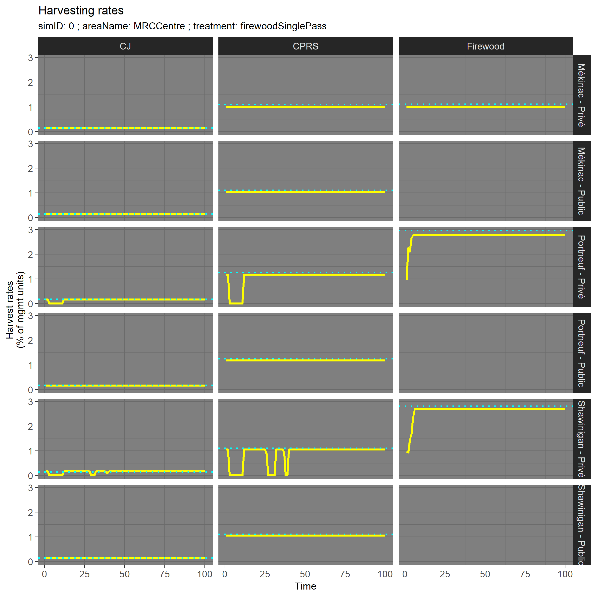
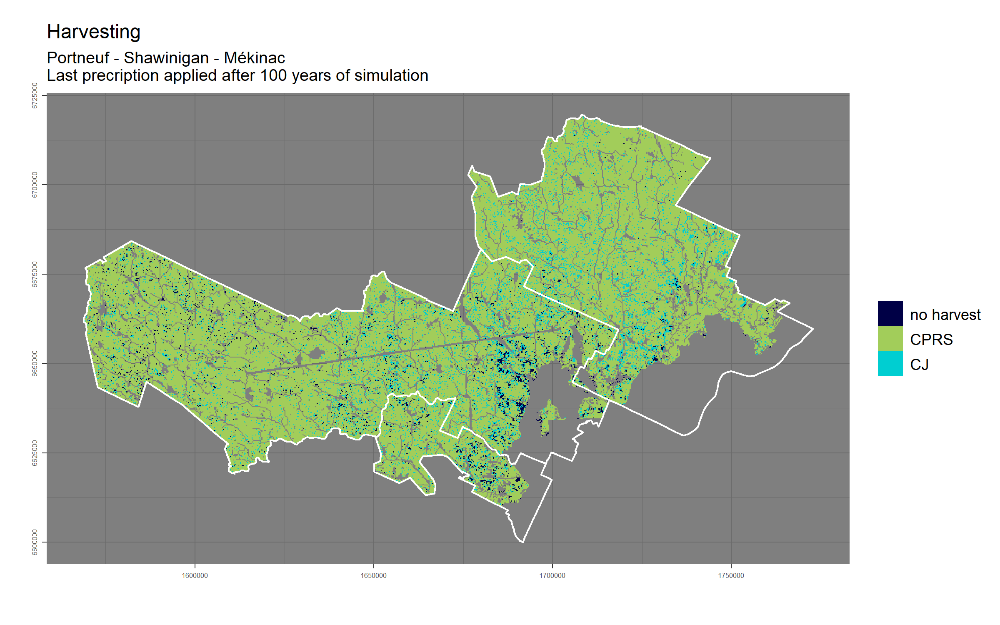
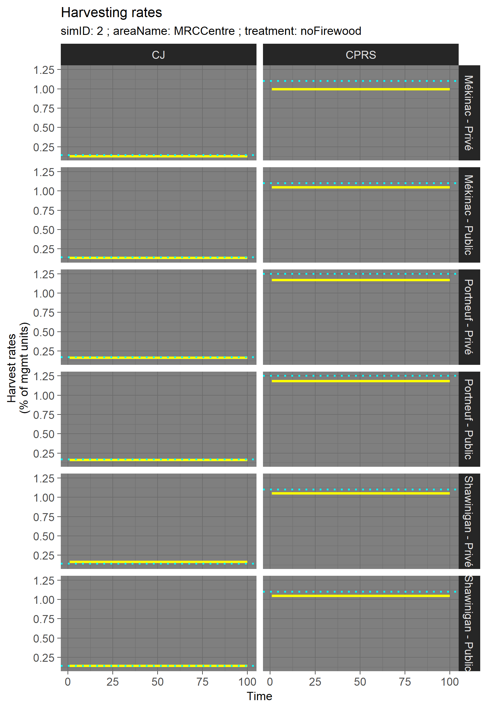

Updated on Apr 18 2019

-------

## General description

For a more general description of this project, its associated objectives and experimental design, [click here][1]

[1]: https://github.com/dcyr/firewood_landis/

-----------

## Study area - MRC 'Centre' (Mékinac, Shawinigan, Portneuf)

-----------
## Preliminary results 
  

### With firewood harvesting  

[Animated figure here][2]

  
  

### Without firewood harvesting  
  
[Animated figure here][3]

  
  

[1]: https://github.com/dcyr/firewood_landis/
[2]: https://github.com/dcyr/firewood_landis/raw/master/figures/harv_MRCCentre_firewoodSinglePass_anim.gif
[3]: https://github.com/dcyr/firewood_landis/raw/master/figures/harv_MRCCentre_noFirewood_anim.gif

