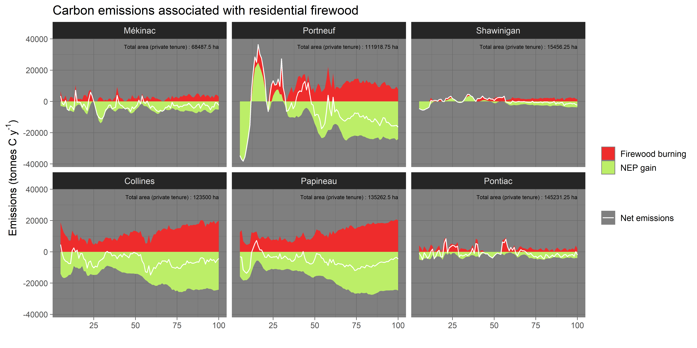
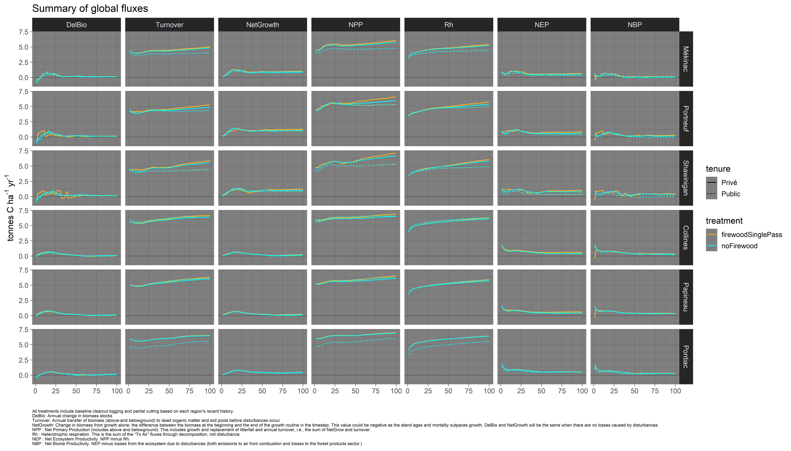
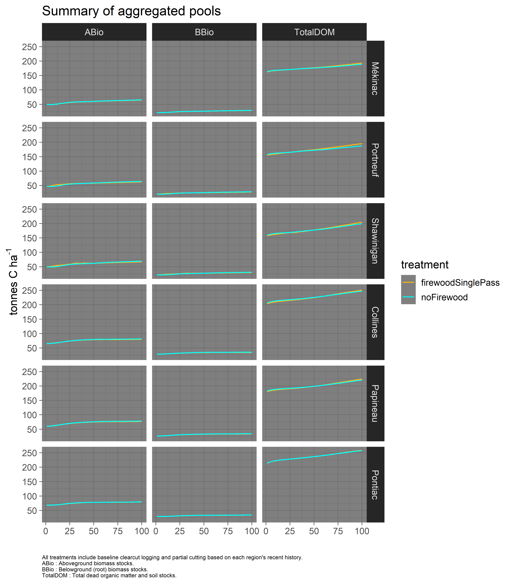

Updated on Apr 12 2019

-------

### General description

This repository contains input files, documentation and simulation outputs (coming soon).

-----------

### Study area

The study areas are located in the Sugar Maple and Yellow birch bioclimatic domain of Southern Quebec (Fig. 1). More specifically each of the simulated areas includes 3 MRCs _(Municipalités régionales de comté)_. The westernmost one is located in Outaouais, while the other one is located in Mauricie and Centre-du-Québec.

For a more detailed description of each simulation areas, with associated results, click on the links below.

- [MRC 'Centre' (Mékinac, Shawinigan, Portneuf)][1]
- [MRC 'Outaouais' (Collines, Papineau, Pontiac)][2]

[1]: https://github.com/dcyr/firewood_landis/MRCCentre.md
[2]: https://github.com/dcyr/firewood_landis/MRCOuta.md

-----------  

-----------

### Preliminary results
Disclaimer: These results are preliminary and __will__ change. They are presented here to verify the current implementation of the experiment and the overall dynamics of the simulated systems. Modification of the input parameters are planned and may substantially affect results.

Note that net emissions caused associated with production and consumption of firewood are currently estimated indirectly, which explains some of the interannual variations. Upcoming simulations (replication of each treatment) will smooth out some of those variations.
  
  

  
   

  

-----------

