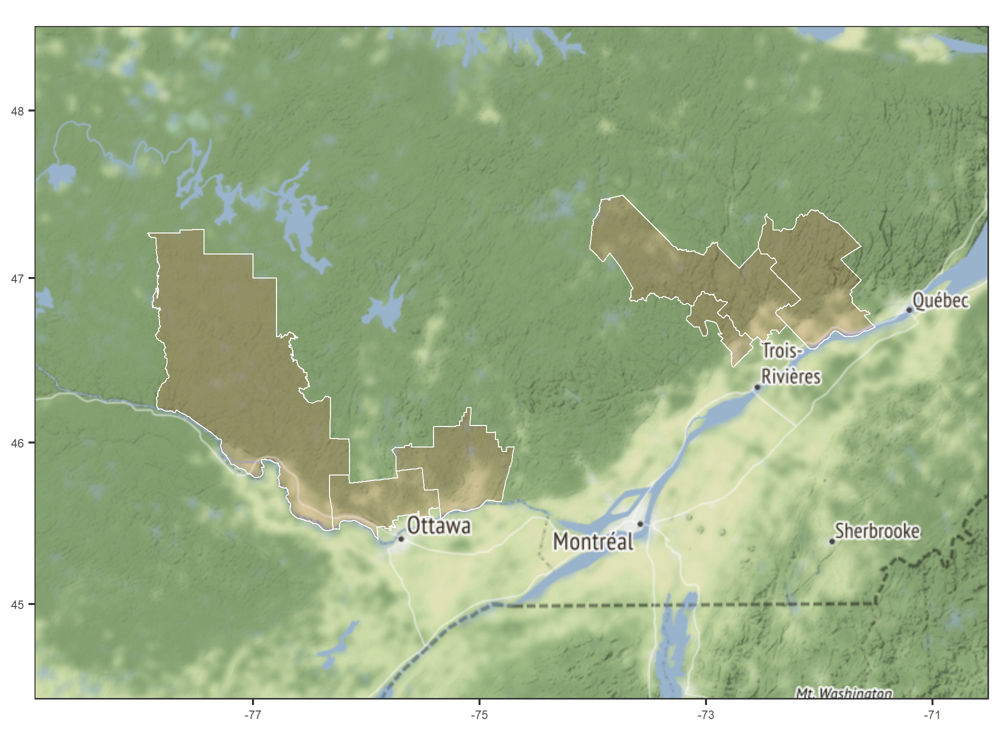

Updated on Feb 12 2019

-------

### General description

This repository contains input files, documentation and simulation outputs (coming soon).

-----------

### Study area

The study areas are located in the Sugar Maple and Yellow birch bioclimatic domain of Southern Quebec (Fig. 1). More specifically each of the simulated areas includes 3 MRCs _(Municipalités régionales de comté)_. The first one is located in Outaouais (Fig. 2), while the second one is located in  Mauricie and Centre-du-Québec (Fig. 3).

-----------  

#### Figure 1

  
  
#### Figure 2

#### Figure 3

-----------

